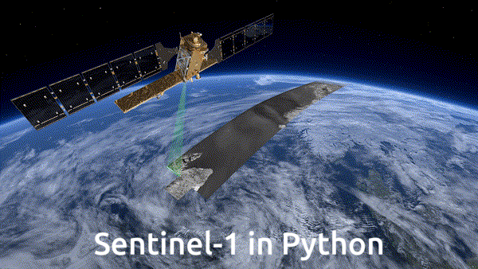
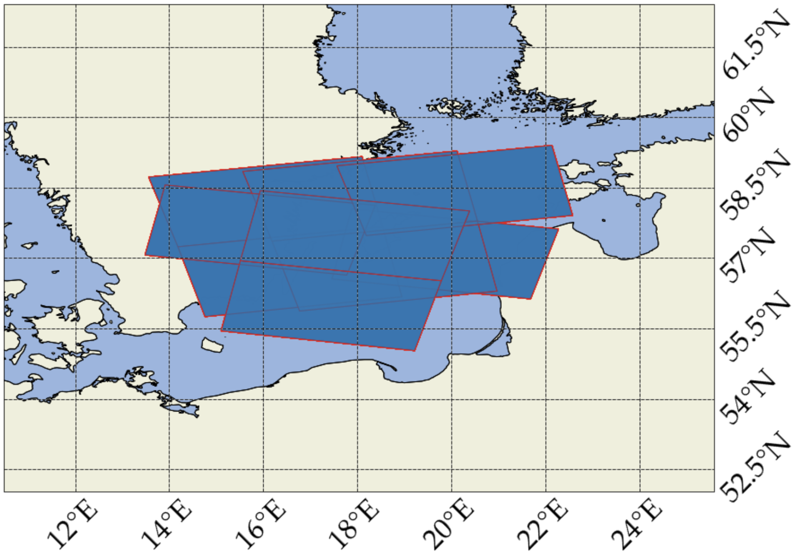
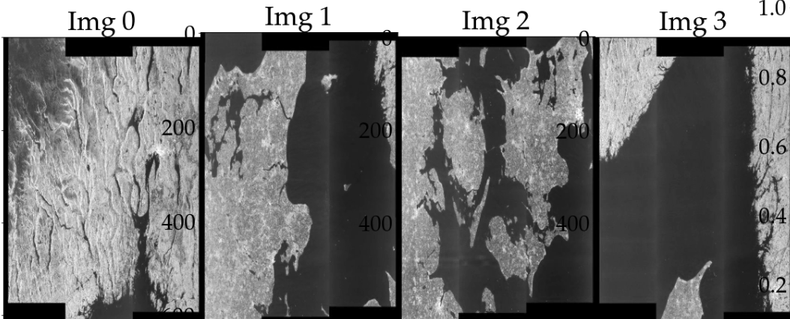
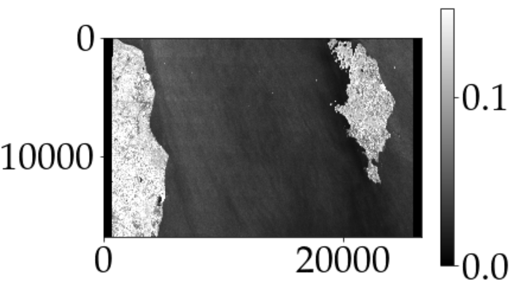

[](https://coveralls.io/github/aalling93/Sentinel_1_python)
 
[](https://snyk.io/test/github/aalling93/Sentinel_1_python/)


Kristian Aalling Sørensen

kaaso@space.dtu.dk

# Brief Description
<a class="anchor" id="intro"></a>


This is a Python module for working with Sentinel-1 satellite images, purly in Python. It allows you to find the images you want, download them and work with them (calibrate, speckle fitler etc.).. I use the SentinelSAT package for the metadata. The data is then downloaded from NASA ASF. 

Why? Because I don't to work with ESA SNAP. Also, in this was it is easier to have my entire workflow in Python.. 

I make no guarantees for the quality, security or anything. Use it as you wish. 


# Table Of Contents
<a class="anchor" id="content"></a>

-  [Introduction](#Introduction)
-  [Requirements](#Requirements)
-  [Install and Run](#Install-and-Run)
*  [Use Sentinel-1 images in Python](#use)
*  [SAR, briefly](#sar)
-  [Acknowledgments](#Acknowledgments)


# Requirements
 <a class="anchor" id="Requirements"></a>

- [numpy](https://github.com/numpy) 
- [geopandas](https://github.com/geopandas) 
- [mgrs](https://github.com/mgrs)  (should be removed in later version.. sry..)
- [scikit-learn](https://github.com/scikit-learn) (should be removed in later version.. sry..)
- [scipy](https://github.com/scipy) (should be removed in later version.. sry..)
- [cartopy](https://github.com/cartopy) 
- [Pillow](https://github.com/Pillow) 
- [pandas](https://github.com/pandas) 
- [sentinelsat](https://github.com/sentinelsat) 
- [matplotlib](https://github.com/matplotlib) 


# Install and Run
 <a class="anchor" id="Install-and-Run"></a>

This repo can be installed using either git clone OR pypi.. Currently, I have only placed it in pypi-test, so lets hope it stays there..


**Using Pypi**

 1.  GDAL. Make sure your gdal bindings are working... 

 2. Install sentinel_1_python using pypy test
 ```
python3 -m pip install sentinel-1-python --extra-index-url=https://test.pypi.org/simple/
 ```


**Using clone**

 1.  Install all requirements

 2. Clone 
 ```
 git clone https://github.com/aalling93/sentinel_1_python.git

 ```


## Use Sentinel-1 images in Python <a class="anchor" id="use"></a>
Go back to [Table of Content](#content)

1. Get metadata of images
------------

```python
with Sentinel_metadata() as met:
    met.area([29.9,21,56.7,58])
    met.get_metadata(sensor='s1_slc',start_data='20220109',end_date='20221010')
```

2. Filter the images if you want
----------------
```python
met.iw() #filer so we only have IW
```


3. Displaying the images before download:
```python
met.plot_image_areas() # Showing extent of images
met.show_cross_pol(4)
```
We can then see then extent of the images.



And display the images before downloading them...



4. Download the images
--------------
```python
folder = f'{os.getenv("raw_data_dir")}/slc_sweden'
with Satellite_download(met.products_df) as dwl:
    os.makedirs(folder, exist_ok=True)
    #save metadata
    dwl.products_df.to_pickle(f'{folder}/slc_dataframe.pkl')
    #download the thumbnails
    dwl.download_thumbnails(folder=f'{folder}/slc_thumbnails') 
    #download the slc images in .zip format and extract to .SAFE format..
    dwl.download_sentinel_1(f'{folder}/slc')
```


5. Load, calibrate, speckle filter image in python

```python
image_paths = glob.glob(f'{os.getenv("raw_data_dir")}/*/*/*.SAFE')
img = s1_load(image_paths[0])
img =img.calibrate(mode='gamma') # could also use, e.g., 'sigma_0' 
img = img.boxcar(5) #could easily make, e.g., a Lee filter..
img.simple_plot(band_index=0)
```




we can now exctract a region of the image, defined by either index or coordinate set.
```python
indx = img.get_index(lat=57.0047,long=19.399)
img[indx[0]-125:indx[0]+125,indx[1]-125:indx[1]+125].simple_plot(band_index=1)
```


------------


## SAR satellites <a class="anchor" id="sar"></a>
Go back to [Table of Content](#content)

A Synthetic Aperture Radar (SAR) is an active instrument that can be used for e.g. non-cooperative surveillance tasks. Its biggest advantages over e.g. MSI, is that it works day and night, and that it can see though clouds and rain. By placing the SAR instrument on a satellite, it is possible to acquire global coverage with design-specific temporal and spatial resolution. Consequently, by combining, e.g., <font color=yellow> AIS </font>and <font color=yellow> SAR instruments</font>, cooperative and non-cooperative surveillance can be acquired.


A radar is an instrument that is emitting electromagnetic pulses with a specific signature in the microwave spectrum. For a mono-static radar, the radar instrument is both transmitting and receiving the backscatter signal from the pulse. The backscatter signal depends on the structure of the target it illuminated and thus, by comparing the well-known transmitted and received signal, it is possible to describe both the geometrical and underlying characteristics of the target using the mono-static radar equation:

$P_r = \frac{P_t \lambda^2 G(\phi, \theta)^2}{(4 \pi )^3 R^4}\sigma (\phi,\theta),$


where 𝑃𝑟 is the received signal derived from the transmitted signal, 𝑃𝑡. The variable 𝜆 is the design specific wavelength of the radar, and 𝐺(𝜙,𝜃) the radar Gain pattern. The signal is dispersed according to the distance travelled, 𝑅. The radar cross-section, 𝜎(𝜙, 𝜃), can therefore be derived and is describing the target’s dielectric and geometrical characteristics and is dependant on the angles 𝜙 and 𝜃. <font color=yellow> However, in the presence of noise, another contrubution must be added to the mono-static radar equation. In my other Repo, https://github.com/aalling93/Finding-on-groud-Radars-in-SAR-images,  I work with Radio Frequency Interfence (</font> <font color=red> RFI</font>) <font color=yellow>. A phenomenan where other signals from other radars interfer with the SAR signal. </font>
Generally speaking, 𝜎(𝜙,𝜃) is describing the available energy within the target area and must therefore be normalised with the area. The radar backscattering coefficient is found by:

$\sigma^0(\phi, \theta) = \frac{\sigma (\phi, \theta)}{Area}, $

where different areas can be used depending on the problem at hand. When using a SAR as an imaging radar, each pixel in the image has a phase and an amplitude value. By calibrating the image, it is possible to get the radar backscattering coefficient as seen in the equation. <font color=yellow>. In this module, it is possible to download load and calibrate Sentinel-1 images without the need of external software or, e.g., the (infamous) Snappy package.</font> 


Since a SAR is getting a backscatter contribution from all objects within the area illuminated, a noise-like phenomena called speckle arises. This results in a granular image where each pixel is a combination of the backscatter from the individual object in the area. </font> <font color=yellow>  In my repo, https://github.com/aalling93/Custom-made-SAR-speckle-reduction, I have implemented several differente Speckle filters and show the difference under varying conditions. </font>.

A SAR imaging radar differs from a normal radar, by utilising the movement of its platform to synthesise a better resolution, hence the name Synthetic Aperture Radar. When taking pictures of a stationary target, a doppler frequency is found from the velocity of the platform. The SAR is emitting and receiving several pulses to and from the same target. When the SAR is flying towards its target, it will measure a positive doppler frequency which is decreasing until it is perpendicular to the target whereafter it will experience an increasing negative doppler frequency


The electromagnetic signal is transmitted with either a horizontal or a vertical polar- isation, with full parametric SARs being capable of transmitting both horizontal and vertical polarisation. Due to the interaction of the transmitted pulse with the target, both a vertical and horizontal signal is reflected back to the SAR. This causes several different scattering mechanism to occur. Several types of scattering mechanisms ex- ists. For ship detection, the most prominent are Surface scattering and Double bounce scattering. 


#### Surfance scattering

A transmitted signal will be partly absorbed, and partly reflected by the object it illuminates. Surface scattering is the scattering describing the reflected signal. If a surface is completely smooth(specular), no backscatter is reflected back to the SAR. If the surface is rough, a scattering occurs and part of the incident pulse is scattered back to the SAR. Rough surfaces have a higher backscatter as compared to smoother surfaces. Moreover, VV and HH has a higher backscatter compared to VH and HV(HV and VHthey are almost always the same) for both rough and smooth surfaces.  A moist surface results in a higher Radar Cross Section. The backscatter of a surface depends on the roughness and dielectric constant of the target it illuminates. The ocean surface will therefore often result in a small backscatter due to its wet and relatively smooth surface (at low wind speeds), even considering its high dielectric constant at SAR frequencies.


#### Double bounce scattering


Double bounce scattering and occurs when the transmitted pulse is reflected specularly twice from a corner back to the SAR. This results in a very high backscatter. Ships often have many corners and are very smooth, resulting in an especially high backscatter. It is therefore often easy to differentiate e.g. ships with the ocean surface. For more information on the scattering mechanisms on the oceans. As aforementioned, several other scattering mechanisms exist and when detecting e.g. ships in SAR images in the Arctic, volume scattering has to be considers as well.

#### SAR and moving targets


Due to the geometry of the SAR and its moving platform, typical SAR imaging sensors are designed to take focused images with good resolution under the assumption that their target is stationary during image acquisition. This focusing can not be made on moving targets, and normal SAR instruments are therefore ill suited to detect fast moving objects, such as ships. The results is a well resolved static background and poorly resolved moving target. In non-cooperative surveillance tasks, this is a significant problem. Under the assumption that a target is moving perpendicular to the line of sight of the SAR with a constant acceleration, it is possible to reduce the problem by taking the doppler shift of the SAR images into consideration. Maritime vessels do not normally follow such patterns. Hence, more complex trajectory patterns must be accounted for when looking at ships with SAR instruments.

In summary, using the capabilities of a SAR instrument, it should be possible to detect ships on the ocean surface. 


# Acknowledgments
 <a class="anchor" id="Acknowledgments"></a>
Myself, 
Simon Lupemba,
Eigil Lippert

 # Licence
See License file. In short:

1. Cite me in your work! something like: 
Kristian Aalling Sørensen (2020) sentinel_1_python [Source code]. https://github.com/aalling93/sentinel_1_python. email: kaaso@space.dtu.dk
2. Get as many as possible to follow me on Github. You and your colleagues who use this at the very least. I am a like-hunter. 
3. Star this repository, conditioned to the same as above.
4. Maybe write me an email or two, telling me how amazing job I did?
5. Help me with improving the work. I am always looking for collaborators. 